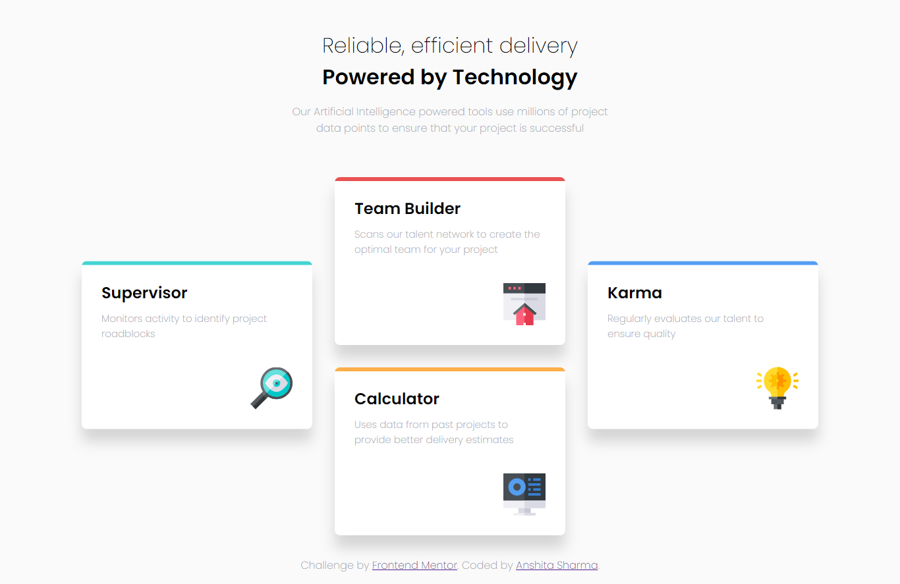
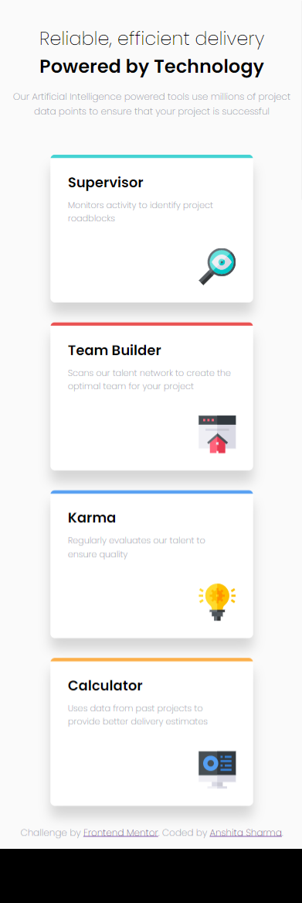

# Frontend Mentor - Four card feature section solution

This is a solution to the [Four card feature section challenge on Frontend Mentor](https://www.frontendmentor.io/challenges/four-card-feature-section-weK1eFYK). Frontend Mentor challenges help you improve your coding skills by building realistic projects. 

## Table of contents

- [Overview](#overview)
  - [The challenge](#the-challenge)
  - [Screenshot](#screenshot)
  - [Links](#links)
- [My process](#my-process)
  - [Built with](#built-with)
  - [Useful resources](#useful-resources)
- [Author](#author)
## Overview

### The challenge

Users should be able to:

- View the optimal layout for the site depending on their device's screen size

### Screenshot

### Links

- Live Site URL: [Add live site URL here](https://your-live-site-url.com)

## My process

### Built with

- Semantic HTML5 markup
- CSS custom properties
- CSS Flexbox
- CSS Transform

### Useful resources

- [Example resource 1](https://developer.mozilla.org/en-US/docs/Web/) - This helped me in learning about flexbox and transform properties more. I really liked this pattern and will use it going forward.

## Author

- Website - [Anshita Sharma](https://github.com/Anshii12/)
- Frontend Mentor - [@Anshii12](https://www.frontendmentor.io/profile/Anshii12)

